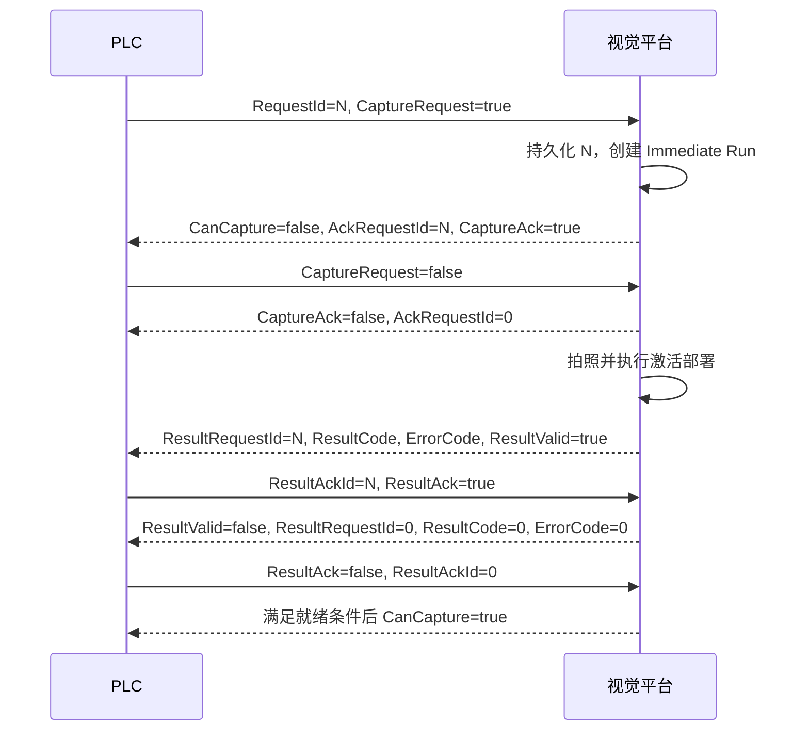

# OPC UA 任务执行握手前端对接文档

> 更新日期：2026-08-02  
> REST 前缀：`/api/app/workflow`  
> 用途：PLC 发起拍照检测，平台回传设备状态、接收确认及 OK/NG/错误结果。

## 1. 核心原则

- 不使用短脉冲，所有握手信号保持到对方确认。
- 谁写入信号，谁负责清零；平台绝不清 PLC 拥有的点位。
- PLC 每次请求使用递增、非零、掉电保持的 `RequestId`。
- 平台持久化 `RequestId、RunId、Phase、Result`，服务重启不得重复拍照。
- 一次结果未被 PLC 确认前，`PC_CanCapture` 始终为 false。

## 2. OPC UA 点位

### 2.1 PLC 写、PLC 清零（平台只读）

| 点位 | 类型 | 写入顺序与含义 |
| --- | --- | --- |
| `PLC_CaptureRequest` | BOOL | 最后写 true；看到同 RequestId 的 CaptureAck 后写 false |
| `PLC_RequestId` | DINT | 先递增并写入，再置 CaptureRequest |
| `PLC_ResultAck` | BOOL | 读取结果后最后写 true；看到 ResultValid=false 后写 false |
| `PLC_ResultAckId` | DINT | ResultAck 对应的 RequestId |

### 2.2 平台写、平台清零（PLC 只读）

| 点位 | 类型 | 含义 |
| --- | --- | --- |
| `PC_Heartbeat` | DINT | 每秒递增；长时间不变化表示平台离线 |
| `PC_DeviceStatus` | DINT | 设备总状态，见 2.3 |
| `PC_TaskStatus` | DINT | OPC 任务握手阶段，见 2.4 |
| `PC_CanCapture` | BOOL | 当前允许发起拍照 |
| `PC_CaptureAck` | BOOL | 已接受请求；PLC 清 Request 后平台清零 |
| `PC_AckRequestId` | DINT | CaptureAck 对应的 RequestId |
| `PC_ResultValid` | BOOL | 结果有效；PLC确认后平台清零 |
| `PC_ResultRequestId` | DINT | 结果对应的 RequestId |
| `PC_ResultCode` | DINT | 检测结果，见 2.5 |
| `PC_ErrorCode` | DINT | 系统错误分类，见 2.6 |

### 2.3 PC_DeviceStatus

`0 Standby / 1 Starting / 2 Running / 3 Paused / 4 Stopping / 5 Stopped / 6 Resetting / 7 FaultAcknowledging / 8 Fault / 9 EmergencyStop / 10 Initializing`

只有 `DeviceStatus=Running` 且运行模式为 `Auto` 或 `Online` 时才可能允许拍照。

### 2.4 PC_TaskStatus

`0 Idle / 1 Accepted / 2 Running / 3 ResultPending / 4 Fault`

### 2.5 PC_ResultCode

`0 None / 1 OK / 2 NG / 3 Error / 4 Canceled`

NG 表示工作流正常执行但检测不合格；Error 表示工作流、设备或结果契约异常，两者不能混用。

### 2.6 PC_ErrorCode

`0 None / 1 WorkflowFailed / 2 ResultVariableMissing / 3 ResultVariableTypeMismatch / 4 Canceled / 5 PlcCommunicationFailed`

## 3. 标准时序



数据字段必须先写，Ack/Valid 位最后写；清除时 Ack/Valid 位先清。

## 4. 任务配置

### 4.1 查询任务配置

`GET /api/app/workflow/projects/{projectId}/tasks`

响应关键字段：

```ts
interface ProjectTaskBatch {
  projectId: string
  taskType: 0 | 1
  cycleIntervalSeconds?: number
  resultWorkflowId?: string
  resultVariableName?: string
  items: Array<{
    id: string
    projectId: string
    workflowId: string
    workflowName: string
    isEnabled: boolean
    orderNo: number
  }>
}
```

### 4.2 保存任务配置

`PUT /api/app/workflow/projects/tasks`

- `items` 是整体覆盖，必须回传查询得到的完整列表。
- OPC 握手启用前必须配置 `resultWorkflowId + resultVariableName`。
- 结果变量必须是所选已启用工作流的正式布尔输出。
- PLC 触发创建的是 Immediate Run，因此生产握手场景使用 `taskType=0`。

保存工作流或任务配置后，需要重新发布并激活部署：

1. `POST /api/app/workflow/projects/{projectId}/deployments`
2. `POST /api/app/workflow/deployments/{deploymentId}/activate`

注意：`GET /projects/{projectId}/deployments` 实际返回单个部署对象，不是数组。

### 4.3 没有激活部署时

没有激活部署属于“任务尚未具备生产运行条件”，不是 PLC 通讯故障。平台行为如下：

- `PC_CanCapture=false`。
- `PC_TaskStatus=Idle`。
- 不写 `PC_CaptureAck=true`，也不创建运行实例。
- `PC_DeviceStatus` 和 `PC_Heartbeat` 继续正常更新。
- 如果 PLC 已经写入 `PLC_CaptureRequest=true`，平台保持等待，不替 PLC 清除请求位。
- PLC 可以继续保持请求，等部署激活后由平台接受；也可以按 PLC 自身超时策略撤销请求并自行清零。

前端进入任务执行页面时应先查询部署：

```http
GET /api/app/workflow/projects/{projectId}/deployments
```

- 返回部署且 `status=2`：当前存在激活部署。
- 接口返回业务错误“当前项目尚未创建部署快照”：显示“请先发布并激活部署”。
- 返回部署但状态不是 `2`：显示“部署尚未激活”，提供激活操作。

如果前端绕过握手直接调用 `POST /api/app/workflow/runs`，后端同样会拒绝创建运行，并返回：

```text
当前项目没有已激活的部署快照，请先发布并激活部署后再创建运行。
```

前端收到该业务错误时应保留 PLC 请求和握手页面状态，仅引导用户完成发布/激活，不应调用强制复位。

## 5. 握手配置接口

### 5.1 查询与保存

```http
GET /api/app/workflow/projects/{projectId}/plc-handshake
PUT /api/app/workflow/projects/{projectId}/plc-handshake
```

PUT Body：

```ts
interface WorkflowPlcHandshakeConfig {
  projectId: string
  plcDeviceId: string
  captureRequestTagId: string
  requestIdTagId: string
  resultAckTagId: string
  resultAckIdTagId: string
  heartbeatTagId: string
  deviceStatusTagId: string
  taskStatusTagId: string
  canCaptureTagId: string
  captureAckTagId: string
  ackRequestIdTagId: string
  resultValidTagId: string
  resultRequestIdTagId: string
  resultCodeTagId: string
  errorCodeTagId: string
  isEnabled: boolean
}
```

注意：`id` 只存在于 GET/PUT 的响应对象中，PUT 请求体不要传 `id`。首次配置时传空字符串会导致 Guid 模型绑定失败。

保存校验：点位必须属于同一 PLC、已启用且不能重复；PLC 拥有点位必须可读，平台拥有点位必须可写；信号位必须为 BOOL，状态/序号/代码必须为 Int32/UInt32/Int64/UInt64。

### 5.2 实时状态

`GET /api/app/workflow/projects/{projectId}/plc-handshake/status`

```ts
interface WorkflowPlcHandshakeStatus {
  projectId: string
  isConfigured: boolean
  isEnabled: boolean
  phase: 0 | 1 | 2 | 3 | 4
  currentRequestId: number
  lastCompletedRequestId: number
  currentRunId?: string
  resultCode: 0 | 1 | 2 | 3 | 4
  errorCode: number
  lastRequestAt?: string
  lastResultAt?: string
  lastError?: string
}
```

页面打开时查询一次；可见期间建议每 1 秒轮询，隐藏后停止轮询。

项目尚未保存握手配置时，状态接口仍返回 200：`isConfigured=false、isEnabled=false、phase=0`。前端应展示“尚未配置”，不得当作服务异常。

### 5.3 管理员强制复位

`POST /api/app/workflow/projects/{projectId}/plc-handshake/reset`

- 需要二次确认。
- 仅复位平台持久化阶段；后台协调器随后清除平台拥有的输出点。
- 不会修改 PLC 的 CaptureRequest、RequestId、ResultAck、ResultAckId。
- 若 PLC 仍保持旧请求，前端应提示 PLC 侧也需按所有权规则自行处理。

## 6. 运行查询

- 创建手动运行：`POST /api/app/workflow/runs`
- 列表：`GET /api/app/workflow/runs?projectId=...&skipCount=0&maxResultCount=20`
- 详情：`GET /api/app/workflow/runs/{runId}`
- 取消：`POST /api/app/workflow/runs/{runId}/cancel`

运行状态：`0 Queued / 1 Running / 2 Succeeded / 3 Failed / 4 Canceled`。

新增结果字段：

```ts
inspectionDecision: 0 | 1 | 2 | 3 | 4
inspectionErrorCode: number
inspectionErrorMessage?: string
```

`status=Succeeded` 只代表程序执行完成；最终合格结论必须读取 `inspectionDecision`。

## 7. 前端页面建议

- 任务配置：启用工作流、排序、选择最终布尔结果变量。
- PLC 映射：按“PLC写”和“平台写”分组选择点位，并显示类型/访问权。
- 部署：显示发布状态，配置变化后提示“需重新发布并激活”。
- 实时状态：设备状态、CanCapture、握手阶段、RequestId、RunId、结果和错误。
- 恢复操作：仅管理员显示强制复位按钮，并保留二次确认。

## 8. 异常与恢复

- PLC 断线：平台保留持久化阶段，每 10 秒重试；重连后重写平台拥有的状态。
- 平台重启：根据数据库阶段和 Run 状态恢复 Ack/Running/Result，不重复创建同 RequestId。
- Request 持续为 true：相同 RequestId 不会重复拍照。
- ResultAckId 不匹配：平台继续保持 ResultValid，不清结果。
- 结果未确认：禁止下一次拍照，不自动超时丢弃。
- 已有 Queued/Running 任务：CanCapture=false，新请求保持等待或由 PLC 自行撤销。
- 没有激活部署：CanCapture=false、不确认拍照请求；部署激活后仍保持的有效请求可继续被接受。

所有浏览器请求继续使用公共认证头，并携带 `X-Aurora-Theme: light|dark`。
