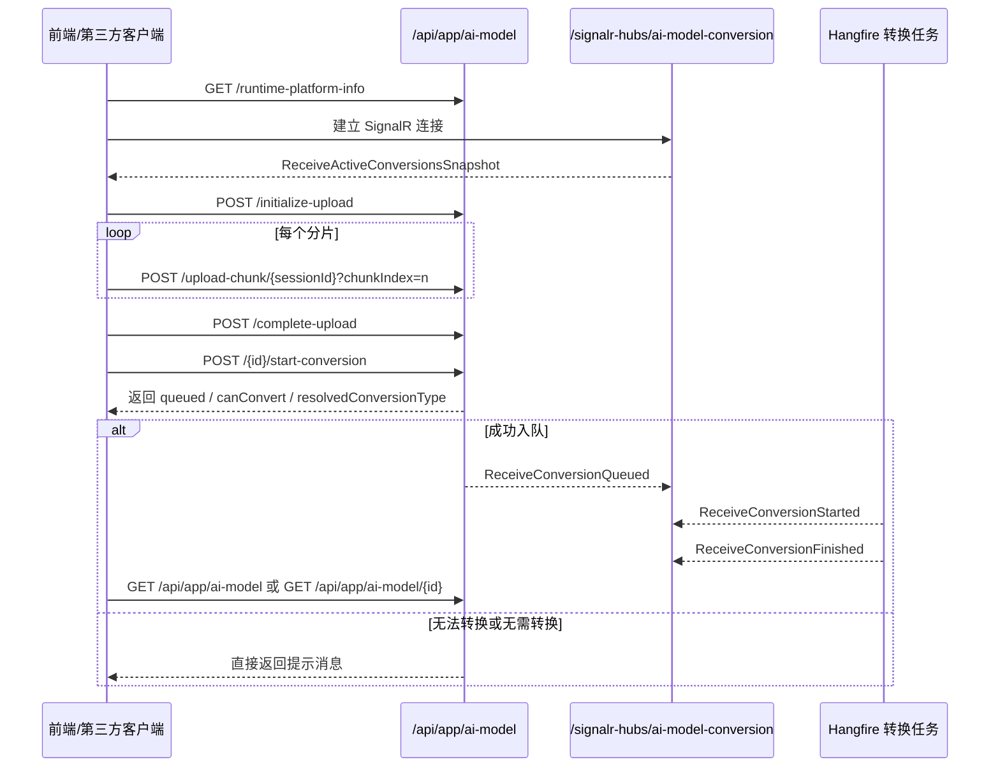

# AI 模型转换接口与 SignalR 说明

## 1. 文档范围

本文档仅覆盖 AI 模型转换相关能力，不展开 AI 模型加载、卸载和通用管理接口。

当前转换链路包含两部分：

1. 模型上传与续传
2. 模型转换发起、状态查询、转换产物删除

接口基础路径：

- `/api/app/ai-model`

协议与鉴权：

- 协议：HTTPS
- 请求体：`application/json` 或 `multipart/form-data`
- 鉴权：默认要求已登录会话或 Bearer Token

---

## 2. 当前实现结论

### 2.1 当前转换模式

当前 AI 模型转换采用“REST 提交 + REST 轮询状态”的模式：

1. 客户端通过 REST 初始化上传会话并上传分片
2. 客户端通过 REST 完成上传并创建模型记录
3. 客户端通过 REST 发起转换
4. 客户端通过 REST 查询模型列表或模型详情中的文件状态，判断转换进度和结果

### 2.2 当前 SignalR 状态

**当前版本没有 AI 模型转换专用 SignalR Hub、Notifier 或事件推送。**

也就是说：

1. 不需要为 AI 模型转换建立专门的 SignalR 连接
2. 上传进度由客户端自行统计本地分片上传进度
3. 转换进度不通过服务端实时推送，而是通过状态查询接口获取

### 2.3 当前实际转换能力

当前版本的实际转换能力为：

1. 支持上传 `onnx`、`rknn`、`rkllm` 文件，但是否允许上传由运行平台能力接口动态决定
2. 当前 Python 转换执行链只支持 **ONNX -> RKNN**
3. `Auto` 模式下，系统可能解析出：
   - 直接使用 ONNX
   - 转 RKNN
   - 需要 RKLLM/NPU 运行
4. 当系统解析结果为 `ToRkllm` 时，不会实际启动转换，而是返回“请直接上传 RKLLM 文件”

---

## 3. 关键枚举与字段语义

### 3.1 AiModelConversionPreference

| 值 | 名称 | 说明 |
| --- | --- | --- |
| `0` | `Auto` | 自动分析，由系统决定最终目标 |
| `1` | `DirectOnnx` | 直接使用 ONNX，不进入转换 |
| `2` | `ToRknn` | 明确要求转 RKNN |

# AI 模型转换接口与 SignalR 说明

## 1. 文档范围

本文档仅覆盖 AI 模型转换相关能力，不展开 AI 模型加载、卸载和通用管理接口。

当前转换链路包含三部分：

1. 模型上传与续传
2. 模型转换发起与防重复控制
3. 模型转换 SignalR 实时状态推送

接口基础路径：

- REST：/api/app/ai-model
- SignalR Hub：/signalr-hubs/ai-model-conversion

协议与鉴权：

- 协议：HTTPS
- 请求体：application/json 或 multipart/form-data
- 鉴权：默认要求已登录会话或 Bearer Token
- SignalR：要求已登录会话或 Bearer Token

---

## 2. 当前实现结论

### 2.1 当前转换模式

当前 AI 模型转换采用“REST 发起 + SignalR 实时推送 + 完成后按需刷新列表”的模式：

1. 客户端通过 REST 初始化上传会话并上传分片
2. 客户端通过 REST 完成上传并创建模型记录
3. 客户端建立 AI 模型转换专用 SignalR 连接
4. 客户端通过 REST 发起转换
5. 服务端通过 SignalR 推送排队、转换中、完成事件
6. 客户端在完成事件后再调用列表或详情接口刷新最终结果

### 2.2 当前 SignalR 状态

当前版本已经提供 AI 模型转换专用 Hub 和阶段事件推送。

已实现能力：

1. 独立 Hub：/signalr-hubs/ai-model-conversion
2. 连接成功后立即下发当前活动转换快照
3. 排队、转换中、完成三类实时事件
4. 失败事件带 conversionErrorMessage

当前未实现能力：

1. 上传进度 SignalR 推送
2. Python 转换百分比进度推送
3. 转换日志流式推送

### 2.3 当前实际转换能力

当前版本的实际转换能力为：

1. 支持上传 onnx、rknn、rkllm 文件，但是否允许上传由运行平台能力接口动态决定
2. 当前 Python 转换执行链只支持 ONNX -> RKNN
3. Auto 模式下，系统可能解析出：
   - 直接使用 ONNX
   - 转 RKNN
   - 需要 RKLLM/NPU 运行
4. 当系统解析结果为 ToRkllm 时，不会实际启动转换，而是返回“请直接上传 RKLLM 文件”
5. 同一模型同一目标类型如果已经存在 Pending 或 Converting 状态，后端会拒绝再次入队
6. 同一模型同一目标类型如果已经存在转换产物，后端会拒绝再次转换，要求先删除产物

---

## 3. 关键枚举与字段语义

### 3.1 AiModelConversionPreference

| 值 | 名称 | 说明 |
| --- | --- | --- |
| 0 | Auto | 自动分析，由系统决定最终目标 |
| 1 | DirectOnnx | 直接使用 ONNX，不进入转换 |
| 2 | ToRknn | 明确要求转 RKNN |
| 3 | ToRkllm | 仅保留为历史兼容值，不建议新写入 |

### 3.2 AiModelResolvedConversionType

| 值 | 名称 | 说明 |
| --- | --- | --- |
| 0 | Unknown | 默认值，上传或编辑请求中应传该值 |
| 1 | DirectOnnx | 系统判断直接使用 ONNX |
| 2 | ToRknn | 系统判断应转换为 RKNN |
| 3 | ToRkllm | 系统判断应直接上传 RKLLM 文件 |

### 3.3 AiModelFileConversionStatus

| 值 | 名称 | 说明 |
| --- | --- | --- |
| 0 | None | 未进入转换流程 |
| 1 | Pending | 已入队，等待转换 |
| 2 | Converting | 转换中 |
| 3 | Completed | 转换完成 |
| 4 | Failed | 转换失败 |

### 3.4 AiModelFileRole

| 值 | 名称 | 说明 |
| --- | --- | --- |
| 0 | SingleWholeModel | 单文件整模 |
| 1 | SplitEncoder | 双文件模型中的编码器 |
| 2 | SplitDecoder | 双文件模型中的解码器 |

### 3.5 文件数量与角色约束

当前后端协议限制：

1. 单个模型最多只支持 2 个原始文件
2. 如果只上传 1 个文件，则其 fileRole 必须为 SingleWholeModel
3. 如果上传 2 个文件，则必须且只能是：
   - 一个 SplitEncoder
   - 一个 SplitDecoder

### 3.6 conversionErrorMessage 约束

当前约定如下：

1. REST 列表和详情中的 files[].conversionErrorMessage 固定存在
2. SignalR 的 AiModelConversionStateDto.conversionErrorMessage 固定存在
3. 无错误时返回 null，不省略字段

---

## 4. 接入总流程



---

## 5. SignalR 说明

### 5.1 Hub 地址

- 路径：/signalr-hubs/ai-model-conversion
- 鉴权：需要 Token 或已登录会话
- 连接时机：建议页面打开后立即连接，而不是点击转换时再临时连接

### 5.2 服务端接口名与前端订阅名

服务端 Hub 客户端接口定义为带 Async 后缀的方法，前端 SignalR 订阅时使用去掉 Async 的事件名。

| 服务端方法 | 前端订阅事件名 | 说明 |
| --- | --- | --- |
| ReceiveActiveConversionsSnapshotAsync | ReceiveActiveConversionsSnapshot | 连接成功后下发当前活动转换快照 |
| ReceiveConversionQueuedAsync | ReceiveConversionQueued | 某模型已进入排队阶段 |
| ReceiveConversionStartedAsync | ReceiveConversionStarted | 某模型已进入转换中阶段 |
| ReceiveConversionFinishedAsync | ReceiveConversionFinished | 某模型已完成，成功或失败 |

### 5.3 活动快照 DTO

SignalR 负载 DTO 为 AiModelConversionStateDto。

| 字段 | 类型 | 说明 |
| --- | --- | --- |
| modelId | string(Guid) | 模型 ID |
| sourceFileIds | string(Guid)[] | 本次参与转换的原始文件 ID 列表 |
| targetType | number  null | 转换目标类型 |
| status | number | 当前阶段状态，值为 Pending、Converting、Completed、Failed 之一 |
| conversionErrorMessage | string  null | 错误消息，无错误时为 null |
| lastUpdatedTime | string  null | 最近状态更新时间 |

### 5.4 ReceiveActiveConversionsSnapshot 说明

客户端连接成功后，服务端会立即查询当前所有原始文件中仍处于 Pending 或 Converting 的记录，并按模型聚合后一次性推送。

注意：

1. 如果当前没有活动转换，返回空数组
2. 快照按模型聚合，而不是按单文件逐条下发
3. 快照主要用于页面刷新、断线重连后恢复状态

### 5.5 SignalR 事件示例

#### 活动快照示例

```json
[
  {
    "modelId": "5f4cb63c-45a0-44ea-a7c7-0500b87a87e3",
    "sourceFileIds": [
      "4e9e9dd0-4783-44d8-b4ef-5188b8bb79e8"
    ],
    "targetType": 2,
    "status": 1,
    "conversionErrorMessage": null,
    "lastUpdatedTime": "2026-06-05T09:20:11Z"
  }
]
```

#### 完成事件示例

```json
{
  "modelId": "5f4cb63c-45a0-44ea-a7c7-0500b87a87e3",
  "sourceFileIds": [
    "4e9e9dd0-4783-44d8-b4ef-5188b8bb79e8"
  ],
  "targetType": 2,
  "status": 4,
  "conversionErrorMessage": "Python 转换结果文件不存在：/tmp/outputs/model.rknn",
  "lastUpdatedTime": "2026-06-05T09:25:42Z"
}
```

### 5.6 当前进度粒度

当前 SignalR 只推送阶段进度，不推送百分比进度。

已支持的阶段：

1. Pending
2. Converting
3. Completed
4. Failed

未支持：

1. 0-100 百分比
2. Python 子步骤明细
3. 输出文件逐个生成进度

---

## 6. REST 接口总览

| 分类 | 方法 | 路径 | 说明 |
| --- | --- | --- | --- |
| 平台能力 | GET | /api/app/ai-model/runtime-platform-info | 获取当前平台支持的模型格式与是否支持 ONNX 转换 |
| 初始化上传 | POST | /api/app/ai-model/initialize-upload | 初始化分片上传会话 |
| 上传分片 | POST | /api/app/ai-model/upload-chunk/{sessionId}?chunkIndex={n} | 上传单个分片 |
| 查询上传进度 | GET | /api/app/ai-model/upload-session-status/{sessionId} | 获取上传会话状态 |
| 查找可续传会话 | GET | /api/app/ai-model/find-upload-session | 按文件特征查找已有上传会话 |
| 完成上传 | POST | /api/app/ai-model/complete-upload | 组装上传文件并创建模型记录 |
| 放弃上传 | POST | /api/app/ai-model/abort-upload/{sessionId} | 取消上传会话 |
| 启动转换 | POST | /api/app/ai-model/{id}/start-conversion | 发起模型转换或获取无需转换结论 |
| 查询模型详情 | GET | /api/app/ai-model/{id} | 获取模型详情和文件转换状态 |
| 查询模型列表 | GET | /api/app/ai-model | 批量获取模型与文件转换状态 |
| 删除转换产物 | DELETE | /api/app/ai-model/{id}/converted-file?fileId={fileId} | 删除已生成的转换文件 |
| 查询日志 | GET | /api/app/ai-model/logs | 查看转换相关操作日志 |

---

## 7. 运行平台能力接口

### 7.1 获取运行平台能力

- 方法：GET
- 路径：/api/app/ai-model/runtime-platform-info

### 7.2 响应示例

```json
{
  "isSupported": true,
  "operatingSystem": "Linux",
  "architecture": "Arm64",
  "platformName": "Linux + Rockchip",
  "unsupportedReason": null,
  "compatibilityDescription": "rockchip,rk3588",
  "supportedExtensions": ["rknn", "rkllm", "onnx"],
  "supportsOnnxConversion": true
}
```

### 7.3 接入建议

不要在客户端硬编码可上传格式或是否支持 ONNX 转换，统一以该接口返回值为准。

---

## 8. 上传与续传接口

### 8.1 初始化上传会话

- 方法：POST
- 路径：/api/app/ai-model/initialize-upload

### 请求体示例

```json
{
  "originalFileName": "encoder.onnx",
  "fileSizeBytes": 268435456,
  "chunkSizeBytes": 16777216,
  "totalChunks": 16,
  "md5": "2F1C8D7B8A7D6A5C4B3E2F1A0B9C8D7E",
  "fileRole": 1,
  "sortOrder": 0
}
```

### 8.2 上传单个分片

- 方法：POST
- 路径：/api/app/ai-model/upload-chunk/{sessionId}
- Query：chunkIndex
- Content-Type：multipart/form-data

### 8.3 查询上传会话状态

- 方法：GET
- 路径：/api/app/ai-model/upload-session-status/{sessionId}

### 8.4 查找已有上传会话

- 方法：GET
- 路径：/api/app/ai-model/find-upload-session

### 8.5 完成上传

- 方法：POST
- 路径：/api/app/ai-model/complete-upload

### 关键约定

1. resolvedConversionType 在上传请求中应始终传 0，也就是 Unknown
2. conversionPreference 建议只传 Auto、DirectOnnx、ToRknn
3. ToRkllm 仅保留为历史兼容值，不建议新请求继续写入

### 8.6 取消上传会话

- 方法：POST
- 路径：/api/app/ai-model/abort-upload/{sessionId}

---

## 9. 启动转换接口

### 9.1 启动模型转换

- 方法：POST
- 路径：/api/app/ai-model/{id}/start-conversion

### 说明

该接口不会上传文件，只会基于已存在的模型记录和原始文件发起转换分析或入队。

### 返回 DTO

```json
{
  "modelId": "5f4cb63c-45a0-44ea-a7c7-0500b87a87e3",
  "conversionPreference": 0,
  "resolvedConversionType": 2,
  "canConvert": true,
  "queued": true,
  "status": 1,
  "message": "模型转换任务已入队，目标类型：ToRknn。"
}
```

### 字段说明

| 字段 | 类型 | 说明 |
| --- | --- | --- |
| modelId | string(Guid) | 模型 ID |
| conversionPreference | number | 用户设置的转换偏好 |
| resolvedConversionType | number | 系统解析后的目标类型 |
| canConvert | boolean | 是否允许进入转换流程 |
| queued | boolean | 是否已经成功入队 |
| status | number | 当前状态，通常为 None、Pending、Converting、Completed 之一 |
| message | string | 提示消息，可直接展示给用户 |

### 典型返回场景

#### 场景 A：成功入队

```json
{
  "modelId": "5f4cb63c-45a0-44ea-a7c7-0500b87a87e3",
  "conversionPreference": 0,
  "resolvedConversionType": 2,
  "canConvert": true,
  "queued": true,
  "status": 1,
  "message": "模型转换任务已入队，目标类型：ToRknn。"
}
```

#### 场景 B：自动分析结果要求直接上传 RKLLM

```json
{
  "modelId": "5f4cb63c-45a0-44ea-a7c7-0500b87a87e3",
  "conversionPreference": 0,
  "resolvedConversionType": 3,
  "canConvert": false,
  "queued": false,
  "status": 0,
  "message": "当前版本不支持由 ONNX 直接转换为 RKLLM。若该模型需要 RKLLM/NPU 加速运行，请直接上传对应的 RKLLM 文件；如需生成 RKLLM，请在外部使用原始 HF 结构完成转换。"
}
```

#### 场景 C：无需转换，直接使用 ONNX

```json
{
  "modelId": "5f4cb63c-45a0-44ea-a7c7-0500b87a87e3",
  "conversionPreference": 1,
  "resolvedConversionType": 1,
  "canConvert": false,
  "queued": false,
  "status": 0,
  "message": "已根据转换偏好直接选择目标类型：DirectOnnx。"
}
```

#### 场景 D：目标转换产物已存在

```json
{
  "modelId": "5f4cb63c-45a0-44ea-a7c7-0500b87a87e3",
  "conversionPreference": 2,
  "resolvedConversionType": 2,
  "canConvert": false,
  "queued": false,
  "status": 3,
  "message": "已存在 ToRknn 转换产物，请先删除后再重新转换。"
}
```

#### 场景 E：同一目标类型已在转换中

```json
{
  "modelId": "5f4cb63c-45a0-44ea-a7c7-0500b87a87e3",
  "conversionPreference": 2,
  "resolvedConversionType": 2,
  "canConvert": false,
  "queued": false,
  "status": 2,
  "message": "模型 ToRknn 转换已在进行中，请稍候。"
}
```

---

## 10. 转换状态查询接口

当前没有单独的“转换任务状态 REST 接口”，转换状态附着在模型文件信息中；但已经提供 SignalR 实时阶段推送。

### 10.1 查询模型详情

- 方法：GET
- 路径：/api/app/ai-model/{id}

### 10.2 查询模型列表

- 方法：GET
- 路径：/api/app/ai-model

### 10.3 重点关注字段

```json
{
  "id": "5f4cb63c-45a0-44ea-a7c7-0500b87a87e3",
  "name": "bge-base-zh",
  "conversionPreference": 0,
  "resolvedConversionType": 2,
  "files": [
    {
      "id": "4e9e9dd0-4783-44d8-b4ef-5188b8bb79e8",
      "originalFileName": "model.onnx",
      "fileFormat": "ONNX",
      "fileRole": 0,
      "isOriginalFile": true,
      "isConvertedFile": false,
      "conversionTargetType": 2,
      "conversionStatus": 2,
      "conversionErrorMessage": null,
      "conversionTime": null
    },
    {
      "id": "98e0d80a-c1d2-4187-8a39-96fb3e7bbd70",
      "originalFileName": "model.rknn",
      "fileFormat": "RKNN",
      "fileRole": 0,
      "isOriginalFile": false,
      "isConvertedFile": true,
      "sourceFileId": "4e9e9dd0-4783-44d8-b4ef-5188b8bb79e8",
      "conversionTargetType": 2,
      "conversionStatus": 3,
      "conversionErrorMessage": null,
      "conversionTime": "2026-06-05T09:20:11Z"
    }
  ]
}
```

### 10.4 推荐使用方式

1. 页面打开时先建立 SignalR 连接
2. 依赖 ReceiveActiveConversionsSnapshot 恢复活动状态
3. 收到 ReceiveConversionFinished 后再刷新列表或详情
4. 若 SignalR 连接失败，再退回到手动刷新或有限次数的兜底查询

---

## 11. 删除转换产物接口

### 11.1 删除已生成的转换文件

- 方法：DELETE
- 路径：/api/app/ai-model/{id}/converted-file

### Query 参数

| 参数 | 类型 | 必填 | 说明 |
| --- | --- | --- | --- |
| fileId | string(Guid) | 是 | 要删除的转换产物文件 ID |

### 用途

当模型已经存在目标类型的转换产物时，后续再次调用启动转换接口会被拦截。若需要重新转换，应先删除已有转换产物。

---

## 12. 故障排查建议

### 12.1 上传阶段

优先检查：

1. runtime-platform-info 返回的 supportedExtensions
2. 上传文件数量与 fileRole 是否满足协议约束
3. find-upload-session 和 upload-session-status 是否能恢复旧会话

### 12.2 转换阶段

优先检查：

1. start-conversion 返回的 resolvedConversionType
2. start-conversion 返回的 canConvert、queued、status
3. 是否返回“已存在转换产物”或“已在进行中”提示
4. SignalR 是否成功连接到 /signalr-hubs/ai-model-conversion
5. 是否收到了 ReceiveConversionQueued、ReceiveConversionStarted、ReceiveConversionFinished
6. 模型详情或列表中的原始文件 conversionStatus
7. conversionErrorMessage

### 12.3 RKLLM 相关

如果返回结果为：

- resolvedConversionType = 3
- canConvert = false

则表示：

1. 当前模型更适合 RKLLM/NPU 运行
2. 当前版本不支持从 ONNX 直接转 RKLLM
3. 应由外部基于原始 HF 结构生成 RKLLM 后再直接上传

---

## 13. 第三方接入建议

建议的最小接入方案：

1. 调用运行平台能力接口决定允许上传的文件类型
2. 采用分片上传，不要直接依赖整文件上传
3. 上传请求中的 resolvedConversionType 固定传 Unknown
4. 页面或客户端启动后尽早建立 SignalR 连接
5. 先消费 ReceiveActiveConversionsSnapshot，再发起新的转换请求
6. 收到 ReceiveConversionFinished 后刷新列表或详情，获取最终文件数据
7. 如果 SignalR 连接失败，可以退回到手动查询列表或详情，但不建议再依赖固定 3 秒轮询作为主流程

### 当前前端实现策略

当前前端 AI 模型管理页的策略是：

1. 页面 mounted 时立即连接 AI 模型转换 Hub
2. 通过活动快照恢复正在转换的模型 ID
3. 点击开始转换后只调用一次 start-conversion
4. 依赖 SignalR 事件驱动页面状态变化
5. 在完成事件后再调用一次列表接口刷新最终结果

### 注意事项

1. 当前 SignalR 只推送阶段状态，不推送百分比
2. 当前 SignalR 事件是按模型聚合的，不是按文件逐条广播
3. conversionErrorMessage 字段应始终按可空字段处理，不要假设缺失
4. 如果客户端自己实现重连逻辑，重连成功后应重新等待 ReceiveActiveConversionsSnapshot
