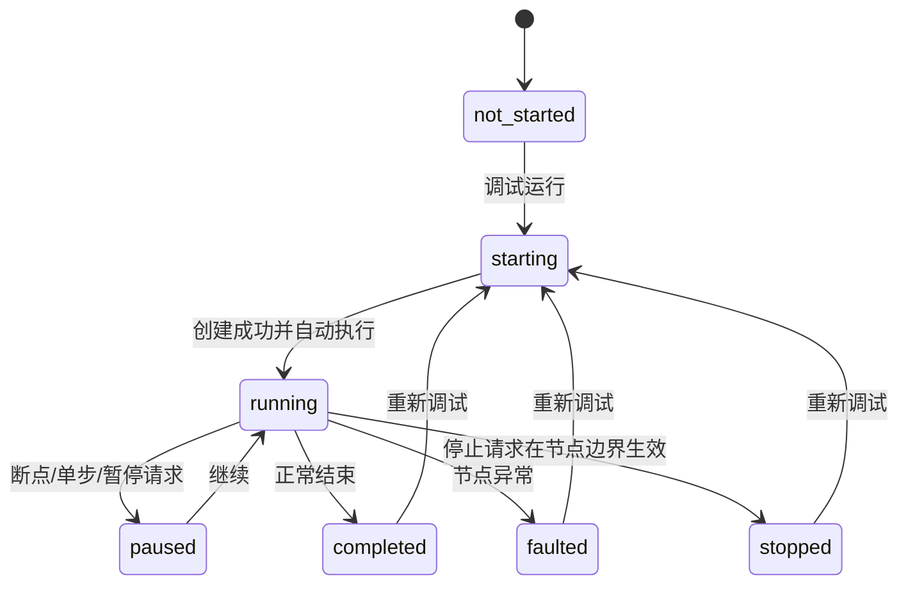

# 第三方工作流完整交互与调试对接方案

> 版本：2026-07-29  
> HTTP 前缀：`/api/app/workflow`  
> SignalR Hub：`/signalr-hubs/workflow-debug`  
> 适用范围：第三方工作流画布、运行和调试前端，不包含源码编辑器和 Monaco

## 1. 对接目标

第三方前端只维护和提交 `GraphData`，不读取或生成工作流脚本。完整页面应包含：

- 项目和工作流选择。
- 算子画布、属性设置、端口连线和结束输出设置。
- 保存、校验和正式运行。
- Visual Studio 风格的调试运行、继续、暂停、停止、单步、断点和运行到节点。
- 变量、监视、执行轨迹、性能、正式结果和文本日志。
- SignalR 实时状态，以及断线轮询和页面刷新恢复。

## 2. 页面结构

推荐布局：

```text
┌ 项目 / 工作流 ─ 保存 ─ 调试运行/继续(F5) ─ 单步(F10) ─ 暂停 ─ 停止 ┐
│ 状态：正在运行 · 平面拟合       5/18       00:09.32              │
├──────────────────────┬───────────────────────────────────────────┤
│ 算子列表             │ 工作流画布                                │
│ 搜索、分类           │ 节点、连线、断点、执行高亮                │
├──────────────────────┴───────────────────────────────────────────┤
│ 问题 | 变量 | 监视 | 跟踪 | 性能 | 结果 | 输出日志              │
└──────────────────────────────────────────────────────────────────┘
```

页面不得提供单独的“创建调试会话”按钮。调试会话是内部实现细节。

## 3. GraphData 与保存

第三方必须保留无法识别的扩展字段，避免往返保存时破坏服务端数据。

```ts
interface WorkflowGraph {
    nodes: Array<Record<string, unknown> & {
        id: string
        type: string
        x?: number
        y?: number
    }>
    edges: Array<Record<string, unknown> & {
        id: string
        sourceNodeId?: string
        targetNodeId?: string
    }>
}
```

核心接口：

| 操作 | HTTP | 地址 |
|---|---|---|
| 工作流列表 | GET | `/api/app/workflow?projectId={projectId}` |
| 工作流详情 | GET | `/api/app/workflow/{workflowId}` |
| 创建 | POST | `/api/app/workflow` |
| 保存 | PUT | `/api/app/workflow/{workflowId}` |
| 删除 | DELETE | `/api/app/workflow/{workflowId}` |
| 校验 | POST | `/api/app/workflow/{workflowId}/validate` |
| 模拟 | POST | `/api/app/workflow/{workflowId}/simulate` |
| 输出路径 | GET | `/api/app/workflow/{workflowId}/output-paths?variableName={name}` |

保存成功后服务端负责生成和编译执行程序。画布存在未保存修改时禁止正式运行和调试，并提示先保存。

## 4. 正式运行

```http
POST /api/app/workflow/executions
Content-Type: application/json
```

```json
{
  "projectId": "项目 GUID",
  "workflowId": "工作流 GUID",
  "mode": 0,
  "loopCount": 1,
  "inputVariableKeys": [],
  "outputVariableNames": []
}
```

- `mode=0`：单次完整运行。
- `mode=2`：按 `loopCount` 循环运行。
- 正式运行不显示断点或单步控件。
- 查询状态：`GET /api/app/workflow/executions/{executionId}?includeVariables=true`。

## 5. 调试状态机



服务端状态字段是唯一权威：

```ts
type DebugState =
    | 'ready'
    | 'running'
    | 'paused'
    | 'completed'
    | 'faulted'
    | 'stopped'

interface WorkflowDebugStatus {
    executionId: string
    runId?: string
    projectId: string
    workflowId: string
    workflowName: string
    debugState: DebugState
    isTerminal: boolean
    canContinue: boolean
    canStep: boolean
    canPause: boolean
    canStop: boolean
    currentNodeId?: string
    currentNodeName?: string
    currentNodeDurationMs: number
    faultNodeId?: string
    errorMessage?: string
    executedSteps: number
    totalSteps: number
    durationMs: number
    variables?: Array<Record<string, unknown>>
    configuredOutputs: ConfiguredOutput[]
    outputs: Array<Record<string, unknown>>
}
```

禁止根据 `executionId`、`currentNodeId` 或状态数字自行推测按钮权限。

## 6. 调试启动与按钮语义

### 6.1 F5 调试运行

```http
POST /api/app/workflow/{workflowId}/source/debug-run
Content-Type: application/json
```

```json
{
  "projectId": "项目 GUID",
  "loopCount": 1,
  "inputVariableKeys": [],
  "outputVariableNames": [],
  "breakpointNodeIds": ["node-1", "node-5"]
}
```

该接口创建会话后立即在后台运行。前端不能再调用一次 `continue`。

操作顺序：

1. 检查工作流已保存。
2. 按钮显示“正在启动”并禁止重复点击。
3. 提交当前完整断点集合。
4. 验证响应 `error=false` 且 `executionId` 不是空 GUID。
5. 立即连接 SignalR 并加入该执行分组。
6. 调用一次状态查询校准，防止执行很快导致错过早期事件。
7. 无断点时运行到结束；有断点时在断点节点执行前暂停。

旧接口 `POST /api/app/workflow/{workflowId}/source/debug` 只用于兼容“创建后停在首节点前”的流程，普通用户界面不直接使用。

### 6.2 按钮矩阵

| 状态 | 主按钮 F5 | 单步 F10 | 暂停 | 运行到节点 | 停止 |
|---|---|---|---|---|---|
| 未调试 | 调试运行 | 可用 | 选中节点时禁用 | 选中节点时可用 | 禁用 |
| `ready/paused` | 继续 | 可用 | 禁用 | 选中节点时可用 | 可用 |
| `running` | 禁用 | 禁用 | 可用 | 禁用 | 可用 |
| `completed/faulted/stopped` | 调试运行 | 可用 | 禁用 | 选中节点时可用 | 禁用 |

无活动会话时点击“单步”或“运行到节点”，前端内部先通过兼容接口创建会话，再发送对应命令；不能要求用户额外点击“创建会话”。

## 7. SignalR 实时对接

### 7.1 建立连接

```ts
import * as signalR from '@microsoft/signalr'

const connection = new signalR.HubConnectionBuilder()
    .withUrl('/signalr-hubs/workflow-debug', {
        accessTokenFactory: () => accessToken,
    })
    .withAutomaticReconnect()
    .configureLogging(signalR.LogLevel.Warning)
    .build()

await connection.start()
await connection.invoke('JoinExecutionAsync', executionId)
```

切换执行会话时：

```ts
await connection.invoke('LeaveExecutionAsync', oldExecutionId)
await connection.invoke('JoinExecutionAsync', newExecutionId)
```

### 7.2 接收事件

```ts
connection.on(
    'DebugStateChangedAsync',
    (
        executionId: string,
        eventType: string,
        updatedAt: string,
        status: WorkflowDebugStatus,
    ) => {
        if (executionId !== activeExecutionId) return
        applyDebugEvent(eventType, status)
    },
)
```

事件列表：

| 事件 | 前端效果 |
|---|---|
| `session-started` | 显示启动成功，准备运行 |
| `running` | 状态栏进入运行中 |
| `node-started` | 当前节点蓝色动态高亮并居中 |
| `node-completed` | 当前节点变绿色，记录耗时 |
| `breakpoint-hit` | 节点黄色高亮，显示断点暂停 |
| `pause-requested` | 显示“等待当前节点完成后暂停” |
| `paused` | 停止运行动画，更新变量和监视 |
| `stop-requested` | 显示“等待当前节点完成后停止” |
| `session-completed` | 自动打开结果面板 |
| `session-faulted` | 异常节点红色高亮并显示错误 |
| `session-stopped` | 显示已停止并保留轨迹 |

`status` 是状态摘要，收到事件后直接更新进度和按钮。暂停或终态时再查询变量、轨迹和性能；不要在每个 `node-started` 事件中同时请求全部详情接口。

### 7.3 断线降级

- `onreconnecting/onclose` 后启动一个 750ms 轮询。
- 轮询：`GET /executions/{executionId}?includeVariables=false`。
- SignalR 重连后重新调用 `JoinExecutionAsync`，查询一次完整状态，然后停止轮询。
- 进入 `completed/faulted/stopped` 后停止轮询。
- 任意时刻只能存在一个状态轮询定时器。

## 8. 单步“执行一个、跳到下一个”效果

### 8.1 单步接口

```http
POST /api/app/workflow/executions/{executionId}/steps
Content-Type: application/json
```

```json
{
  "steps": 1,
  "includeVariables": true
}
```

一次单步的完整动画顺序：

1. 用户点击“单步（F10）”。
2. 当前待执行节点收到 `node-started`：
   - 蓝色流动边框。
   - 自动平移到画布中心。
   - 状态栏显示节点名称和动态耗时。
3. 算子完成后收到 `node-completed`：
   - 刚完成节点由蓝色变绿色。
   - 追加轨迹和节点耗时。
4. 接口最终返回 `paused`：
   - `currentNodeId` 指向下一条待执行节点。
   - 下一节点黄色高亮并自动居中。
   - 刷新变量、调用栈、监视和性能。
5. 再次点击单步，重复以上过程。
6. 最后一个节点执行后直接进入 `completed`，不再显示虚假的下一节点。

推荐节点样式：

```css
.node-running   { outline: 4px solid #3b82f6; animation: pulse 1.2s infinite alternate; }
.node-paused    { outline: 4px solid #eab308; }
.node-completed { outline: 3px solid #22c55e; }
.node-faulted   { outline: 4px solid #ef4444; }
.node-breakpoint::before { content: "●"; color: #ef4444; }
```

若当前算子超过 2 秒，前端使用本地计时器持续显示：

```text
正在执行“平面拟合” · 当前节点耗时 6.32 s
```

不能只等待 HTTP 请求返回。

## 9. 继续、断点、暂停、运行到节点和停止

| 操作 | HTTP | 请求体 |
|---|---|---|
| 继续 | POST `/executions/{id}/continue` | 无 |
| 设置断点 | PUT `/executions/{id}/breakpoints` | 完整断点集合 |
| 查询断点 | GET `/executions/{id}/breakpoints` | 无 |
| 暂停 | POST `/executions/{id}/pause` | 无 |
| 运行到节点 | POST `/executions/{id}/run-to` | `{"nodeId":"..."}` |
| 进入节点 | POST `/executions/{id}/step-into` | 无 |
| 越过节点 | POST `/executions/{id}/step-over` | 无 |
| 跳出工作流 | POST `/executions/{id}/step-out` | 无 |
| 停止 | DELETE `/executions/{id}` | 无 |

断点使用画布节点 ID：

```json
{
  "breakpoints": [
    {
      "nodeId": "node-5",
      "enabled": true,
      "condition": null,
      "hitCount": null,
      "logMessage": null
    }
  ]
}
```

- 继续运行到下一个断点；没有断点则运行到结束。
- 断点在目标节点执行前暂停。
- 暂停和停止不会强杀同步算子，在当前节点完成后的安全边界生效。
- 请求后立即显示 `pause-requested` 或 `stop-requested`，避免用户重复点击。

## 10. 调试详情面板

| 面板 | HTTP |
|---|---|
| 变量 | GET `/executions/{id}/variables` |
| 调用栈 | GET `/executions/{id}/stack` |
| 监视 | POST `/executions/{id}/watch` |
| 轨迹 | GET `/executions/{id}/trace` |
| 分页轨迹 | GET `/executions/{id}/trace-page` |
| 性能 | GET `/executions/{id}/performance` |

展示要求：

- 变量、栈、监视、轨迹和性能使用表格，不直接显示 JSON。
- JSON 只作为“查看原始数据”的辅助入口。
- 运行中只更新轻量状态；暂停和终态后并行刷新详情。
- 同一终态错误按 `executionId + debugState + faultNodeId + errorMessage` 去重，页面恢复和 SignalR 重复通知不能产生两条相同日志。

## 11. 结束输出与结果面板

结束节点输出配置使用三个同键映射：

```json
{
  "inputBindings": {
    "output1": "inspection_status",
    "output2": "result_blob_key"
  },
  "inputBindingSources": {
    "output1": "variable",
    "output2": "variable"
  },
  "inputBindingDisplayNames": {
    "output1": "检测状态",
    "output2": "结果文件"
  }
}
```

Display 名称可不填，未填时使用变量名称。文件、图片和点云先由对应的存 Blob 算子
输出 Blob Key，结束节点选择这个 Key 变量。

只有持久化调试会话状态变为 `completed` 后才能查询：

```http
GET /api/app/workflow/executions/{executionId}/result
```

正式 RunOnce 不调用此接口；应等待状态接口 `isTerminal === true`，再读取
`outputs`。3D 正式对接见
[3D 姿态标定与比较检测工作流第三方对接变更](../06-接口与第三方集成/3D比较检测工作流第三方对接变更-20260826.md)。

响应直接为结束节点选中结果数组：

```ts
interface WorkflowExecutionOutputResult {
    name: string
    displayName: string
    valueType: string
    value: unknown
}
```

该接口不返回状态、内部变量、错误包装、结果图片列表或 `stagedKey`。每个结果的
`name`、`displayName`、`valueType` 和 `value` 与状态接口 `outputs` 中的同名输出一致，
不再对文件地址进行二次转换。`faulted` 和 `stopped` 只展示状态错误，不查询完成结果。

`valueType` 使用稳定令牌：

| 类型 | 令牌 | JSON 值 |
|---|---|---|
| 整数 | `int`、`long` | number |
| 浮点数 | `float`、`double`、`decimal` | number |
| 状态 | `bool` | boolean；`true` 显示绿色 OK，`false` 显示红色 NG |
| 文本 | `string` | string |
| 文件地址或 Blob Key | `string`；旧版本可能为 `blob` | string |
| 结构化数据 | `object`、`array` | object/array |
| 日期与标识 | `datetime`、`guid` | string |

不会返回 `System.Int32` 等 CLR 名称。结束节点选择保存算子的 `download_url` 或
`preview_url` 时，调试和 RunOnce 均返回 `valueType: "string"` 的相对接口地址；选择
`blob_name` 时则均返回原始 Key。旧服务可能把文件结果改写成 `blob`，客户端可兼容。
文件展示根据地址中 `blobName` 的最后一个路径段扩展名决定，且忽略大小写：

| 扩展名 | 展示方式 |
|---|---|
| `.png/.jpg/.jpeg/.bmp/.webp/.tif/.tiff` | 图片预览 |
| `.ply/.pcd/.xyz/.pts/.asc/.obj` | 点云/3D 查看器 |
| `.stl/.glb/.gltf` | 3D 模型查看器 |
| `.step/.stp/.iges/.igs` | CAD 文件下载 |
| `.json` | JSON 结构化查看 |
| `.txt/.csv/.log` | 文本查看 |
| 其他扩展名 | 普通文件下载 |

普通文本即使以文件扩展名结尾也不得按文件渲染；只有明确的 operator-file 地址或旧
`blob` 类型按文件展示。不得根据变量名或 Display 名称猜测文件类型。结束节点若直接
选择 `Mat` 或 `PointCloudData`，前端应提示“请先使用存 Blob 算子”，避免内嵌大型二进制数据。

完成后自动打开“结果”页，同时展示状态、进度、总耗时、输出数量和执行 ID。没有
结果项时提示“工作流执行成功，但结束节点未设置输出”。

## 12. 页面刷新与会话恢复

进入页面后先执行：

```http
GET /api/app/workflow/executions?projectId={projectId}&includeVariables=true
```

恢复步骤：

1. 按当前 `workflowId` 过滤。
2. 优先选择 `isTerminal=false` 的活动会话，否则选择最近终态会话。
3. 保存 `executionId` 和完整状态。
4. 查询断点、轨迹和性能。
5. 使用轨迹恢复已完成节点，使用 `currentNodeId/faultNodeId` 恢复当前节点。
6. 活动会话重新加入 SignalR 分组。
7. `running` 状态恢复本地耗时计时器。
8. 会话不存在时清空失效 ID，回到未调试状态。

恢复日志只写一次，例如：

```text
已恢复调试会话：paused，进度 10/18
```

不能因为页面恢复和 SignalR 随后推送同一终态而重复显示错误。

## 13. 推荐前端控制逻辑

```ts
async function debugRunOrContinue() {
    if (!executionId || status.isTerminal) {
        const result = await debugAndRunSavedWorkflow({
            workflowId,
            projectId,
            breakpointNodeIds,
        })
        executionId = result.executionId
        await connectAndJoin(executionId)
        applyStatus(await getStatus(executionId))
        return
    }

    if (status.canContinue) {
        applyStatus(await continueDebug(executionId))
    }
}

function applyDebugEvent(eventType: string, status: WorkflowDebugStatus) {
    updateToolbar(status)
    updateProgress(status)

    if (eventType === 'node-started') markRunning(status.currentNodeId)
    if (eventType === 'node-completed') markCompleted(status.currentNodeId)
    if (eventType === 'paused' || eventType === 'breakpoint-hit') markPaused(status.currentNodeId)
    if (eventType === 'session-faulted') markFaulted(status.faultNodeId)
    if (status.isTerminal) openResultOrErrorPanel(status)
}
```

## 14. 验收清单

- 点击一次 F5 即开始执行，不再需要点击继续。
- 每个节点开始和完成都有实时高亮变化。
- 单步每次只执行一个节点，完成后黄色光标跳到下一节点。
- 9 秒以上节点持续显示节点名称和动态耗时。
- 断点在节点执行前暂停，继续后不会立即再次命中同一断点。
- 暂停和停止请求立即反馈，并在节点安全边界生效。
- SignalR 断线自动轮询，重连后自动重新加入执行分组。
- 刷新页面可恢复运行、暂停或终态调试会话。
- 完成后自动展示正式结束输出，而不是只显示内部变量或文本日志。
- 同一错误不会因恢复、HTTP 响应和 SignalR 通知重复显示。
- `completed/faulted/stopped` 会话不能继续，重新调试会创建新会话。
