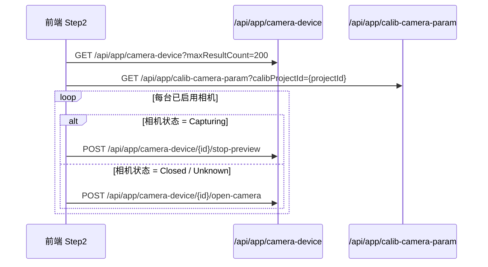
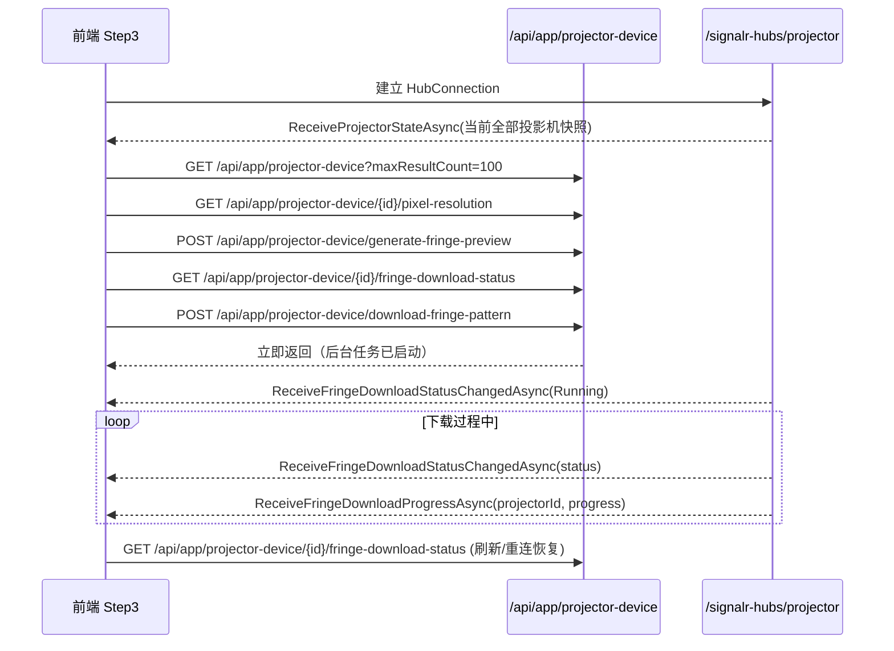

# 标定页面 API 与 SignalR 详细使用手册

## 1. 文档范围

本文档对应当前前端页面：

- `Sources/AuroraStruct3D/AuroraStruct3D.Frontend/src/views/calibration/CalibWizardPage.vue`

当前页面已实际接入的能力只有以下三块：

1. Step 1：标定项目详情读取
2. Step 2：相机参数配置
3. Step 3：投影机参数读取、后端条纹图生成、异步下载、下载状态与进度 SignalR 推送

Step 4 ~ Step 7 在当前页面中仍属于 UI 占位状态，尚未接入新的 REST API 或新的 SignalR 事件。

---

## 2. 总体架构

标定页面当前采用“REST 拉取 + SignalR 增量推送”的模式：

- 初始化、列表、读取、保存：走 REST API
- 长耗时任务进度：走 SignalR
- 前端 API 封装文件：
  - `src/api/calibration.ts`
  - `src/api/cameras.ts`
  - `src/api/projectors.ts`
- 后端 Hub：
  - `/signalr-hubs/projector`

### 2.1 当前页面 API 依赖关系

```mermaid
flowchart TD
    A[CalibWizardPage.vue] --> B[/api/app/calib-project]
    A --> C[/api/app/calib-camera-param]
    A --> D[/api/app/camera-device]
    A --> E[/api/app/projector-device]
    A --> F[/signalr-hubs/projector]
```

### 2.2 页面步骤与接口映射

| 步骤 | 页面用途 | REST API | SignalR |
|------|----------|----------|---------|
| Step 1 | 加载标定项目详情 | `GET /api/app/calib-project/{id}` | 无 |
| Step 2 | 加载相机列表、自动开关相机、读取硬件参数、保存参数 | `camera-device` + `calib-camera-param` | 无 |
| Step 3 | 加载投影机列表、读取像素模式、后端生成条纹预览、异步启动下载、恢复下载状态 | `projector-device` | `projector` Hub |

---

## 3. Step 1：标定项目详情

### 3.1 接口

- 方法：`GET`
- 路径：`/api/app/calib-project/{id}`
- 前端函数：`getCalibProjectAsync(id)`

### 3.2 用途

进入标定向导页时，根据路由参数中的项目 ID 拉取项目基础信息，用于左侧基本信息展示和步骤上下文。

### 3.3 响应 DTO

`CalibProjectDto`

```json
{
  "id": "guid",
  "name": "项目名称",
  "description": "描述",
  "deviceSeries": 1,
  "deviceType": 3,
  "cameraCount": 2,
  "projectorCount": 1,
  "calibStatus": 4,
  "creationTime": "2026-06-02T08:00:00Z",
  "lastModificationTime": "2026-06-02T09:00:00Z"
}
```

### 3.4 前端调用示例

```ts
const id = route.params['id'] as string
project.value = await getCalibProjectAsync(id)
```

---

## 4. Step 2：相机参数配置

Step 2 涉及两类后端资源：

1. 相机设备资源：`/api/app/camera-device`
2. 标定相机参数资源：`/api/app/calib-camera-param`

其中：

- 相机设备资源用于“连接硬件、读取 GenICam 节点”
- 标定相机参数资源用于“保存到标定项目上下文”

### 4.1 Step 2 初始化时序



### 4.2 获取相机列表

- 方法：`GET`
- 路径：`/api/app/camera-device`
- 前端函数：`getCameraList(params)`

#### 常用请求参数

```json
{
  "maxResultCount": 200
}
```

#### 典型响应

```json
{
  "items": [
    {
      "id": "guid",
      "name": "左相机",
      "deviceIndex": 0,
      "description": null,
      "isEnabled": true,
      "status": 1,
      "statusText": "Ready",
      "imageRotationAngle": 0,
      "model": "MV-CS200-10GC"
    }
  ],
  "totalCount": 1
}
```

### 4.3 读取历史保存的标定相机参数

- 方法：`GET`
- 路径：`/api/app/calib-camera-param?calibProjectId={projectId}`
- 前端函数：`getCalibCameraParamListAsync(calibProjectId)`

#### 用途

用于在进入 Step 2 时回填以下信息：

- CMOS 尺寸
- 镜头焦距
- 光圈上下限与当前值
- 历史保存的图像分辨率
- 历史保存的曝光范围

### 4.4 自动处理相机连接状态

当前页面进入 Step 2 后会对每台已启用相机执行自动状态修正：

#### 4.4.1 正在采集时先停止预览

- 方法：`POST`
- 路径：`/api/app/camera-device/{id}/stop-preview`
- 前端函数：`stopPreview(id)`

#### 4.4.2 未连接时自动打开相机

- 方法：`POST`
- 路径：`/api/app/camera-device/{id}/open-camera`
- 前端函数：`openCamera(id)`

### 4.5 从相机硬件读取参数

Step 2 读取硬件参数不是逐项请求，而是走批量 GenICam 读取：

- 方法：`POST`
- 路径：`/api/app/camera-device/{id}/batch-get-gen-iCam-params`
- 前端函数：`batchGetGenICamParams(id, nodes)`

#### 请求体

```json
{
  "nodes": [
    { "nodeName": "Width", "dataType": "int" },
    { "nodeName": "Height", "dataType": "int" },
    { "nodeName": "ExposureAuto", "dataType": "int" },
    { "nodeName": "ExposureAutoMinTime", "dataType": "int" },
    { "nodeName": "ExposureAutoMaxTime", "dataType": "int" }
  ]
}
```

#### 响应体

```json
{
  "results": [
    { "nodeName": "Width", "value": "2448", "success": true, "access": "ReadOnly" },
    { "nodeName": "Height", "value": "2048", "success": true, "access": "ReadOnly" },
    { "nodeName": "ExposureAuto", "value": "2", "success": true, "access": "ReadWrite" },
    { "nodeName": "ExposureAutoMinTime", "value": "1", "success": true, "access": "ReadWrite" },
    { "nodeName": "ExposureAutoMaxTime", "value": "500000", "success": true, "access": "ReadWrite" }
  ]
}
```

#### 前端处理规则

页面当前会把读取结果转成本地 `cameraHardware`：

- `Width` / `Height`：转为整数
- `ExposureAuto`：用于判断当前是否启用自动曝光
- `ExposureAutoMinTime` / `ExposureAutoMaxTime`：按整数读取并保存
- 当 `ExposureAuto != Off(0)` 时显示真实的最小/最大曝光时间
- 当 `ExposureAuto == Off(0)` 时，页面强制显示 `0`

#### 关键注意事项

`SaveCalibCameraParamInput` 中：

- `ExposureTimeMinUs` 是 `int?`
- `ExposureTimeMaxUs` 是 `int?`

因此前端读取曝光时间时必须按整数处理，不能再把浮点数传回去，否则会导致 400 验证错误。

### 4.6 保存标定相机参数

- 方法：`POST`
- 路径：`/api/app/calib-camera-param/save`
- 前端函数：`saveCalibCameraParamAsync(input)`

> 说明：前端当前实际调用的是 `/save` 动作路由，而不是基础资源根路径。文档以现有前端行为为准。

#### 请求体

```json
{
  "calibProjectId": "guid",
  "cameraDeviceId": "guid",
  "name": "左相机",
  "description": null,
  "isEnabled": true,
  "sensorSize": "1/1.8\"",
  "sensorWidthMm": 7.2,
  "sensorHeightMm": 5.4,
  "imageWidthPixels": 2448,
  "imageHeightPixels": 2048,
  "lensFocalLength": 16,
  "maxAperture": 2.8,
  "minAperture": 16,
  "currentAperture": 5.6,
  "exposureTimeMinUs": 120,
  "exposureTimeMaxUs": 50000,
  "gainMinDb": null,
  "gainMaxDb": null
}
```

#### 后端写入规则

后端 `CalibCameraParamAppService.SaveAsync()` 采用 `(CalibProjectId, CameraDeviceId)` 幂等 Upsert。

写入逻辑有三个特征：

1. 若同一项目下已存在同一相机记录，则执行更新
2. 若不存在，则新建记录
3. 只有“参数组完整”时才会写入对应参数段

具体说：

- 传感器参数要求以下字段都存在：
  - `SensorSize`
  - `SensorWidthMm`
  - `SensorHeightMm`
  - `ImageWidthPixels`
  - `ImageHeightPixels`
- 镜头参数要求以下字段都存在：
  - `LensFocalLength`
  - `MaxAperture`
  - `MinAperture`
  - `CurrentAperture`
- 曝光范围当前只要求以下字段都存在：
  - `ExposureTimeMinUs`
  - `ExposureTimeMaxUs`

当前后端已经放宽了写入条件：

- 只要 `ExposureTimeMinUs` 与 `ExposureTimeMaxUs` 存在，就会落库
- `GainMinDb` / `GainMaxDb` 若未传，则保留实体当前值

因此 Step 2 当前页面虽然不再展示“增益模式”，也不采集增益区间，但曝光范围已经可以正常保存到数据库。

### 4.7 Step 2 前端调用示例

```ts
await saveCalibCameraParamAsync({
    calibProjectId: project.value.id,
    cameraDeviceId: cam.id,
    name: cam.name,
    description: cam.description ?? null,
    isEnabled: cam.isEnabled,
    sensorSize: form?.sensorSize ?? null,
    sensorWidthMm: cmos?.widthMm ?? null,
    sensorHeightMm: cmos?.heightMm ?? null,
    imageWidthPixels: hw?.imageWidthPixels ?? null,
    imageHeightPixels: hw?.imageHeightPixels ?? null,
    lensFocalLength: form?.lensFocalLength ?? null,
    maxAperture: form?.maxAperture ?? null,
    minAperture: form?.minAperture ?? null,
    currentAperture: form?.currentAperture ?? null,
    exposureTimeMinUs: hw?.exposureTimeMinUs ?? null,
    exposureTimeMaxUs: hw?.exposureTimeMaxUs ?? null,
})
```

---

## 5. Step 3：投影机参数与条纹图下载

Step 3 依赖的后端资源有两类：

1. REST：`/api/app/projector-device`
2. SignalR：`/signalr-hubs/projector`

### 5.1 Step 3 初始化时序



### 5.2 获取投影机列表

- 方法：`GET`
- 路径：`/api/app/projector-device`
- 前端函数：`getProjectorList(params)`

#### 常用请求参数

```json
{
  "maxResultCount": 100
}
```

#### 用途

页面只筛选 `isEnabled = true` 的投影机作为可选设备。

### 5.3 读取投影机像素模式

- 方法：`GET`
- 路径：`/api/app/projector-device/{id}/pixel-resolution`
- 前端函数：`getProjectorPixelResolution(id)`

#### 响应体

```json
{
  "widthPixels": 1280,
  "pixelMode": "1280 Pixel Mode"
}
```

#### 说明

- 该接口当前通过底层 `Fp` 指令读取投影机像素模式
- 返回的是“宽度像素数 + 模式描述字符串”
- 当前页面中的高度像素仍由用户输入 `projectorHeightInput`

### 5.4 下载条纹图到投影机 Flash

- 方法：`POST`
- 路径：`/api/app/projector-device/download-fringe-pattern`
- 前端函数：`downloadFringePattern(input)`

#### 当前行为

该接口现在不再等待设备下载完成才返回，而是：

1. 在服务端校验输入参数
2. 生成本次下载需要写入的条纹数据
3. 将投影机状态置为 `Running`
4. 启动后台任务执行真实下载
5. HTTP 接口立即返回

也就是说，下载生命周期现在由“服务端后台任务 + 状态存储 + SignalR”负责，前端不再依赖长时间挂起的 HTTP 请求。

#### 请求体

```json
{
  "projectorId": "guid",
  "fringeMode": "vertical",
  "fringeType": "bw",
  "widthPixels": 1280,
  "heightPixels": 800,
  "periodCount": 8,
  "imageCount": 4,
  "phaseShift": 2
}
```

#### 字段说明

| 字段 | 含义 |
|------|------|
| `projectorId` | 投影机设备 ID |
| `fringeMode` | `horizontal` 横条纹，`vertical` 竖条纹 |
| `fringeType` | `bw` 黑白首色黑，`wb` 白黑首色白 |
| `widthPixels` | 投影宽度像素，来自 `Fp` 查询 |
| `heightPixels` | 投影高度像素，当前由用户输入 |
| `periodCount` | 周期数，要求能整除有效像素数 |
| `imageCount` | 生成图像张数 |
| `phaseShift` | 每张图相对前一张的像素位移 |

### 5.5 后端条纹生成规则

当前 Step 3 的“生成图像”与“下载图像”都统一使用后端同一套条纹生成逻辑。

前端点击“生成图像”时调用：

- 方法：`POST`
- 路径：`/api/app/projector-device/generate-fringe-preview`
- 前端函数：`generateFringePreview(input)`

后端返回每张图的 1 维灰度序列：

- 竖条纹：长度 = `widthPixels`
- 横条纹：长度 = `heightPixels`

生成规则：

1. 根据 `periodCount` 计算单条纹宽度
2. 根据 `fringeType` 确定首色黑还是白
3. 对每张图按 `phaseShift` 做循环平移
4. 最终生成二值条纹，灰度只有 `0` 或 `255`

前端收到响应后只负责：

- 将后端返回的 Base64 像素串解码为 `Uint8Array`
- 渲染到 canvas 进行预览

因此当前浏览器端已经不再本地计算条纹图像。

### 5.6 后端下载到设备的实际命令流程

当前 HID/TCP 底层下载流程已经按设备协议调整为：

1. `S6`：切到默认显示/Flash 播放模式
2. `LN`：开灯
3. `MB N`：写入总图像幅数
4. `MF%d %d %d %d %d`：按帧配置横竖方向位图

- 第 1 个参数块索引：`0~3`，每块覆盖 32 幅图
- 后 4 个参数（`0~255`）共 32bit，对应 32 幅图方向
- 每幅图 1bit：`0=竖条纹`，`1=横条纹`
- 当前策略：固定 `1-2-1-2...`（横竖交替）

5. `FE`：擦除 Flash
   - 期望回复 `F0`
   - 如果回复 `F1` 则重试
2. 循环发送 `FW{index} {gray}`
   - 每条命令后等待 25ms
   - 到 page 边界或最后一条后等待设备应答

### 5.7 Step 3 前端调用示例

```ts
const images = await generateFringePreview({
  projectorId: selectedProjectorId.value,
  fringeMode: fringeMode.value,
  fringeType: fringeType.value,
  widthPixels: projectorWidthPixels.value,
  heightPixels: projectorHeightInput.value,
  periodCount: fringe3PeriodCount.value,
  imageCount: fringe3ImageCount.value,
  phaseShift: fringe3PhaseShift.value,
})

await downloadFringePattern({
    projectorId: selectedProjectorId.value,
    fringeMode: fringeMode.value,
    fringeType: fringeType.value,
    widthPixels: projectorWidthPixels.value,
    heightPixels: projectorHeightInput.value,
    periodCount: fringe3PeriodCount.value,
    imageCount: fringe3ImageCount.value,
    phaseShift: fringe3PhaseShift.value,
})
```

---

## 6. Projector SignalR 使用手册

### 6.1 Hub 地址

- 地址：`/signalr-hubs/projector`
- 后端 Hub：`ProjectorHub`
- 访问策略：允许匿名访问

### 6.2 当前页面连接方式

```ts
step3Hub = new signalR.HubConnectionBuilder()
    .withUrl('/signalr-hubs/projector', { skipNegotiation: false })
    .withAutomaticReconnect()
    .configureLogging(signalR.LogLevel.Warning)
    .build()
```

#### 说明

- `skipNegotiation: false`：走标准协商流程
- `withAutomaticReconnect()`：前端自动重连
- 当前页面只在 Step 3 初始化时建立连接
- 页面卸载时会主动 `stop()`

### 6.3 Hub 连接成功后的行为

前端一旦连接成功，后端 `OnConnectedAsync()` 会立刻查询全部投影机列表，并逐台向当前连接推送：

- `ReceiveProjectorStateAsync(projector)`

这属于“连接后快照同步”。

### 6.4 当前 Hub 定义的客户端事件

#### 6.4.1 ReceiveProjectorStateAsync

```ts
ReceiveProjectorStateAsync(projector: ProjectorDeviceDto)
```

用途：

- 连接后推送当前所有投影机状态快照
- 也可用于后续广播单台设备的最新状态

#### 6.4.2 ReceiveProjectorConnectionChangedAsync

```ts
ReceiveProjectorConnectionChangedAsync(projectorDeviceId: string, status: string)
```

用途：

- 投影机连接状态变化广播

#### 6.4.3 ReceiveProjectorLedChangedAsync

```ts
ReceiveProjectorLedChangedAsync(projectorDeviceId: string, ledStatus: string)
```

用途：

- 投影机开灯/关灯状态变化广播

#### 6.4.4 ReceiveFringeDownloadProgressAsync

```ts
ReceiveFringeDownloadProgressAsync(projectorDeviceId: string, progress: number)
```

用途：

- 推送条纹图下载进度
- `progress` 范围为 `0 ~ 100`

#### 6.4.5 ReceiveFringeDownloadStatusChangedAsync

```ts
ReceiveFringeDownloadStatusChangedAsync(status: {
  projectorId: string
  status: 'Idle' | 'Running' | 'Completed' | 'Failed'
  progress: number
  errorMessage: string | null
})
```

用途：

- 推送条纹图下载任务状态变更
- 用于前端刷新后恢复“是否仍在下载中”
- 用于接收完成/失败状态，而不是只依赖进度包

### 6.5 当前标定页实际监听的事件

当前 `CalibWizardPage.vue` 实际监听了两个与 Step 3 强相关的事件：

```ts
step3Hub.on('ReceiveFringeDownloadStatusChangedAsync', (status) => {
  applyFringeDownloadStatus(status)
})
```

```ts
step3Hub.on('ReceiveFringeDownloadProgressAsync', (projectorId: string, progress: number) => {
    if (projectorId === selectedProjectorId.value) {
        fringeDownloadProgress.value = Math.round(progress)
    }
})
```

也就是说：

- `ReceiveProjectorStateAsync`、`ReceiveProjectorConnectionChangedAsync`、`ReceiveProjectorLedChangedAsync` 目前虽然在 Hub 接口里存在
- 但当前标定页没有消费这些事件
- 当前页面真正依赖的是：
  - `ReceiveFringeDownloadStatusChangedAsync`
  - `ReceiveFringeDownloadProgressAsync`

此外，前端还会在以下时机主动查询一次当前下载状态：

- Step 3 初始化后
- SignalR 重连后
- 切换当前选中投影机后
- 调用下载接口返回后

### 6.6 服务端推送路径

当前服务端推送链路为：


### 6.7 进度推送实现注意事项

当前实现已经规避了三个典型问题：

1. 前端长请求超时问题

- 下载接口改为后台启动后立即返回，不再依赖长时间 HTTP 挂起

1. 刷新后无法恢复下载状态的问题

- 通过 `ProjectorFringeDownloadStateStore` + `GET /fringe-download-status` + SignalR 状态事件恢复 UI

1. `Progress<int>` + `async void` 问题
   - 当前已改为 `Func<int, Task>` 串行 await 推送
   - 避免 fire-and-forget 导致二次下载时进度错乱或丢失

---

## 7. 当前页面的前端调用总清单

### 7.1 Step 1

- `getCalibProjectAsync(id)`

### 7.2 Step 2

- `getCameraList({ maxResultCount: 200 })`
- `getCalibCameraParamListAsync(projectId)`
- `stopPreview(cameraId)`
- `openCamera(cameraId)`
- `batchGetGenICamParams(cameraId, nodes)`
- `saveCalibCameraParamAsync(input)`

### 7.3 Step 3

- `getProjectorList({ maxResultCount: 100 })`
- `getProjectorPixelResolution(projectorId)`
- `generateFringePreview(input)`
- `getProjectorFringeDownloadStatus(projectorId)`
- `downloadFringePattern(input)`
- `SignalR: /signalr-hubs/projector`
- `SignalR event: ReceiveFringeDownloadStatusChangedAsync`
- `SignalR event: ReceiveFringeDownloadProgressAsync`

---

## 8. 常见问题与排查建议

### 8.1 保存相机参数时报 400

优先检查：

1. `ExposureTimeMinUs` / `ExposureTimeMaxUs` 是否仍然是浮点数
2. 请求体是否有空字符串 `""` 混入数值字段
3. 当前路由是否与前端封装一致

### 8.2 二次下载时进度不更新

优先检查：

1. 页面是否重复创建了多个 HubConnection
2. 当前监听的 `projectorId` 是否与选中投影机一致
3. `GET /api/app/projector-device/{id}/fringe-download-status` 是否能查到 `Running`
4. 服务端是否仍使用 `Func<int, Task>` 串行推送
5. 当前投影机是否被状态存储判定为已有任务在执行

### 8.3 投影机像素模式读到乱码

优先检查：

1. HID 读取前是否清空了残留输入缓冲区
2. 是否读到了上一条命令的旧响应
3. 底层 `Fp` 响应是否是本次命令返回而不是历史数据

### 8.4 条纹预览尺寸与设备分辨率不一致

当前页面已按实际分辨率设置 canvas：

- 宽度：`projectorWidthPixels`
- 高度：`projectorHeightInput`

如果仍不一致，应优先检查：

1. `Fp` 返回的宽度是否正确
2. 用户输入高度是否与真实投影高度一致
3. 当前是横条纹还是竖条纹

---

## 9. 推荐联调顺序

### 9.1 Step 2 联调

1. 打开页面，确认项目详情能正常加载
2. 进入 Step 2，确认相机列表能拉到
3. 检查相机是否会自动从 `Closed/Unknown` 切到可连接状态
4. 手动点击“从相机读取”，确认 GenICam 节点返回正常
5. 点击“保存参数”，确认相机参数记录能成功写入数据库

### 9.2 Step 3 联调

1. 进入 Step 3，确认 Hub 已连接
2. 读取像素模式，确认能拿到 `widthPixels`
3. 点击“生成图像”，确认后端接口能返回条纹预览数据，预览分辨率与设备一致
4. 点击下载，确认 REST 接口立即返回而不是长时间挂起
5. 立即查询 `fringe-download-status`，确认状态为 `Running`
6. 观察 SignalR 是否持续收到 `ReceiveFringeDownloadStatusChangedAsync` 与 `ReceiveFringeDownloadProgressAsync`
7. 下载中刷新页面，确认进入 Step 3 后仍能恢复“下载中”状态
8. 下载完成后确认设备端图案可正常播放

---

## 10. 后续扩展建议

如果后续要继续完善标定页面，建议优先补这三类能力：

1. Step 2 增益范围读写
   - 这样曝光/增益参数段才能完整落库
2. Step 3 设备状态事件消费

- 将 `ReceiveProjectorStateAsync`、`ReceiveProjectorConnectionChangedAsync`、`ReceiveProjectorLedChangedAsync` 真正绑定到页面 UI

1. Step 4 ~ Step 7 的 API 与 SignalR 设计
   - 采集任务进度
   - 标定计算任务进度
   - 结果预览与导出
